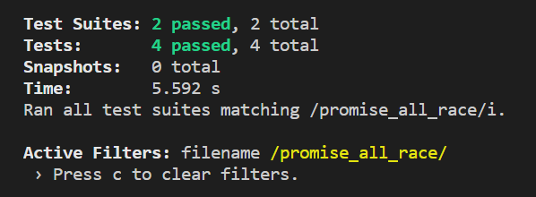

# 坚持造轮子第二次写 - Promise.all/race

二话不说 轮子我都会造 还怕你面试问吗？
一天造一个轮子，干就完了。

## 看点
- 针对大厂笔试、面试必考手写题目
- TDD方式开发
- 配合视频讲解


## 造轮子计划
（计划赶不上变化 随时迭代 欢迎留言 随时摸鱼）
- 框架基础
  - [模板引擎](https://juejin.im/post/6884138429181870093)
  - 防抖
  - 节流
  - 前端路由
  - 统一状态管理
  - 时间旅行
  - HTML编译器
  - Pipe管道
  - 双向绑定
  - 原生Ajax
- JS基础
  - Compose
  - Promise
  - Promise.all/race
  - 路由
  - new
  - call/apply/bind
  - Object.create
  - 深拷贝、浅拷贝
- 算法、设计模式
  - 二分查找
  - 快排
  - 二分查找
  - 冒泡排序
  - 选择排序
  - 订阅发布
  - 斐波那契算法
  - 去重

## Promise.all，Promise.race

Promise.all是解决并发问题的，多个异步并发获取最终的结果（如果有一个失败则失败）, Promise.race用于多个请求，谁先返回用谁。


## 需求
如果调多个Promise请求, 并等待所有Promise返回后，得到所有Promise结果集后再做处理。

Promise.all全部返回成功测试
```js
const Promise = require('../index');

const p1 = new Promise((resolve, reject) => {
  setTimeout(() => {
    resolve('1');
  }, 1000)
})

const p2 = new Promise((resolve, reject) => {
  setTimeout(() => {
    resolve('2')
  }, 1000);
})

it('Promise.all全部返回成功测试', (done) => {
  Promise.all([p1, p2, 3, 4, 5]).then(data => {
    expect(data).toEqual([ '1', '2', 3, 4, 5 ]);
    done();
  }, err => {
    console.log('reject: ', err);
  });
});
```

Promise.all其中一个返回失败测试
```js
const Promise = require('../index');

const p1 = new Promise((resolve, reject) => {
  setTimeout(() => {
    resolve('1');
  }, 1000)
})

const p2 = new Promise((resolve, reject) => {
  setTimeout(() => {
    resolve('2')
  }, 1000);
})

const p3 = new Promise((resolve, reject) => {
  setTimeout(() => {
    reject('fail');
  }, 50)
})

it('Promise.all其中一个返回失败测试', (done) => {
  Promise.all([p1, p2, p3, 3, 4]).then(data => {
    console.log('resolve:', data);
  }, err => {
    expect(err).toBe('fail');
    done();
  })
})
```

## 功能实现
### Promise.all

> 使用方法
传递个数组, 数组中可以是一个具体的值或一个promse, 最终再返回一个promise.

根据传过去的数组，对数组进行遍历，如果当前项不是一个promise则将其保存在resultArr中,<br/>
否则调用promise，将其返回的值再保存在resultArr中，当遍历完再将结果依promise返回。

**源码:**
```js
// 引用之前已写好的promise
const { FullPromise } = require('../promise');
const Promise = FullPromise;

/*
* 为Promsie添加all方法, Promise.all是解决并发问题的，多个异步并发获取最终的结果(如果有一个失败则失败)
*/
Promise.all = ( values ) => {
  if ( !Array.isArray(values) ) {
    const type = typeof values;

    throw new TypeError(`TypeError: ${type} ${values} is not iterable`);
  }
  else {
    return new Promise((resolve, reject) => {
      let resultArr = [],           // 保存所有并发的值
          orderIndex = 0;           // values的索引值

      values.forEach((value, i) => {
        // 如果时个promise, 则获取promise的值
        if ( value && typeof value.then === 'function' ) {
          value.then(res => {
            processResultByKey( res, i );
          }, reject);
        }
        // 否则直接获取值
        else {
          processResultByKey( value, i );
        }
      })

      function processResultByKey( value, index ) {
        resultArr[index] = value;        // 保存结果

        if ( ++orderIndex === values.length ) {
          resolve(resultArr);            // 最终以promise返回所有的值
        }
      }
    });
  }
}

module.exports = Promise;
```

## 需求
如果调多个Promise请求, 谁先返回用谁，并返回promise。

Promise.race全部返回成功测试用例, Promise.race最快的一个返回失败测试用例。
```javascript
const Promise = require('../index');

const p1 = new Promise((resolve, reject) => {
  setTimeout(() => {
    resolve('1');
  }, 1000)
})

const p2 = new Promise((resolve, reject) => {
  setTimeout(() => {
    resolve('2')
  }, 1000);
})

const p3 = new Promise((resolve, reject) => {
  setTimeout(() => {
    reject('fail');
  }, 50)
})

const p4 = new Promise((resolve, reject) => {
  setTimeout(() => {
    resolve('success');
  }, 200);
})

it('Promise.race全部返回成功测试用例', (done) => {
  Promise.race([p1, p2, p4]).then(data => {
    expect(data).toBe('success');
    done();
  }, err => {
    console.log('promise.race fail: ' + err);
    done();
  })
})

it('Promise.race最快的一个返回失败测试用例', (done) => {
  Promise.race([p1, p2, p3]).then(data => {
    expect(data).toBe('success');
    done();
  }, err => {
    expect(err).toBe('fail');
    done();
  })
})
```

## 功能实现
### Promise.race

> 使用方法
传递个数组, 数组中可以是一个具体的值或一个promse, 最终再返回一个promise.

根据传过去的数组，对数组进行遍历，谁最先返回就用谁的返回值。

**源码:**
```javascript
// 引用之前已写好的promise
const { FullPromise } = require('../promise');
const Promise = FullPromise;

/*
* Promise添加race方法, Promise处理多个请求时，采用最快的(谁先完成用谁)
*/
Promise.race = function( promises ) {
  return new Promise((resolve, reject) => {
    for ( let i = 0, len = promises.length; i < len; i++ ) {
      const value = promises[i];

      if ( value && typeof value.then === 'function' ) {
        value.then(resolve, reject);
      }
      else {
        resolve(value);
        break;
      }
    }
  });
}

module.exports = Promise;
```


## 测试



OK 任务完成

## 关注全栈然叔 带你坚持天天造轮子 （周末休息 拒绝996）
- ### 源码地址 https://github.com/su37josephxia/wheel-awesome